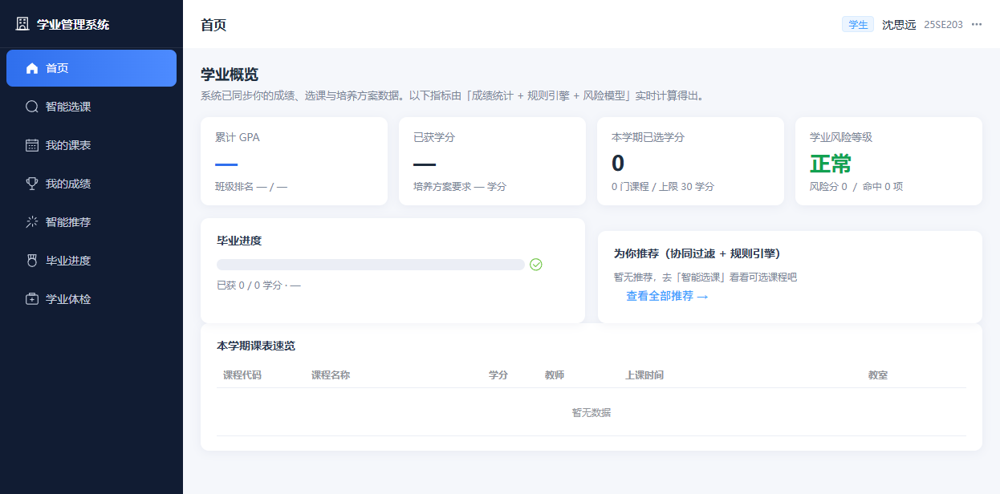
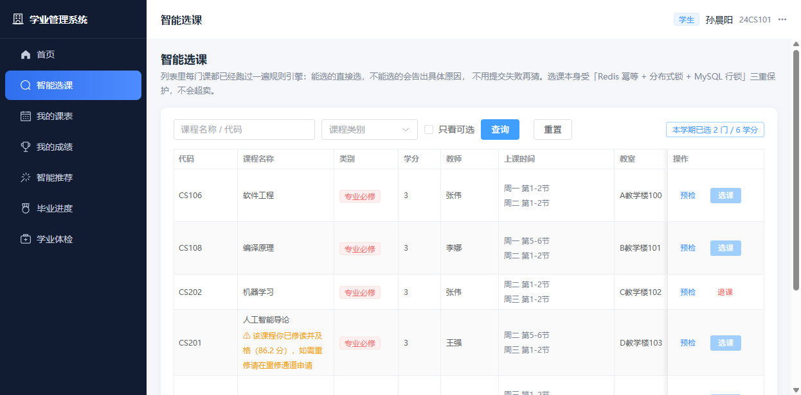
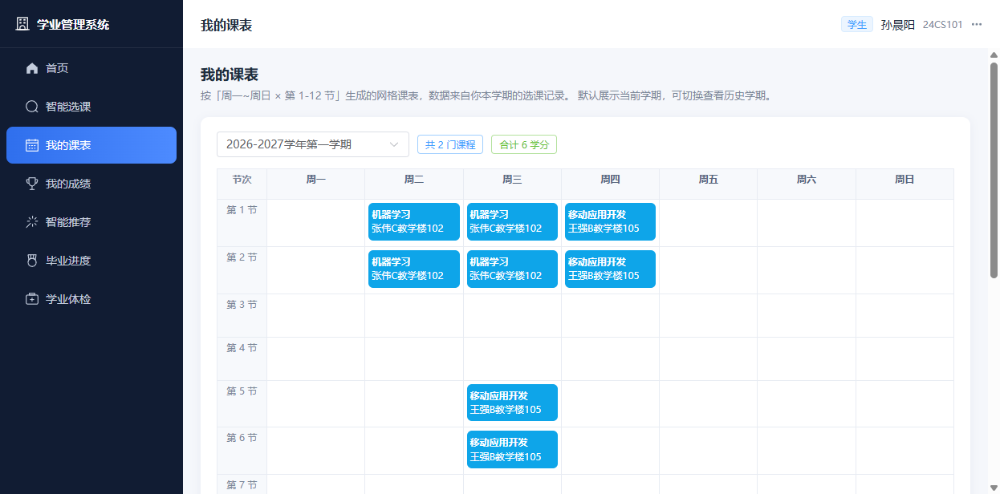
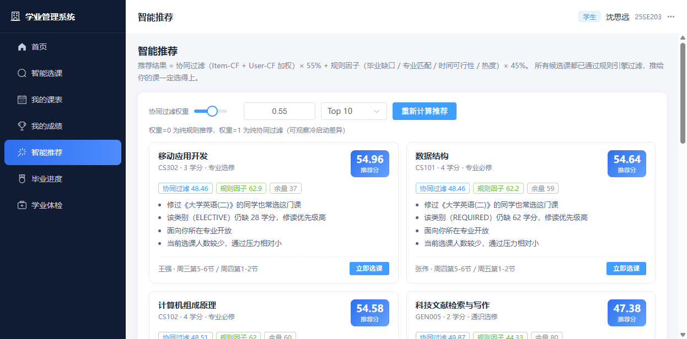
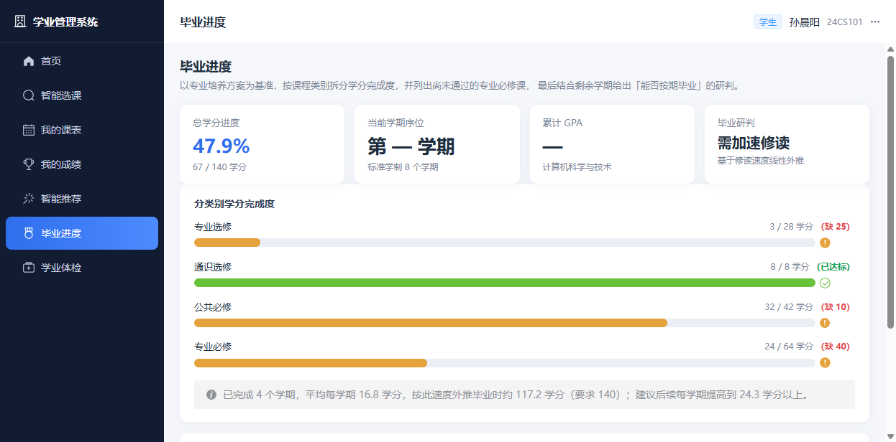
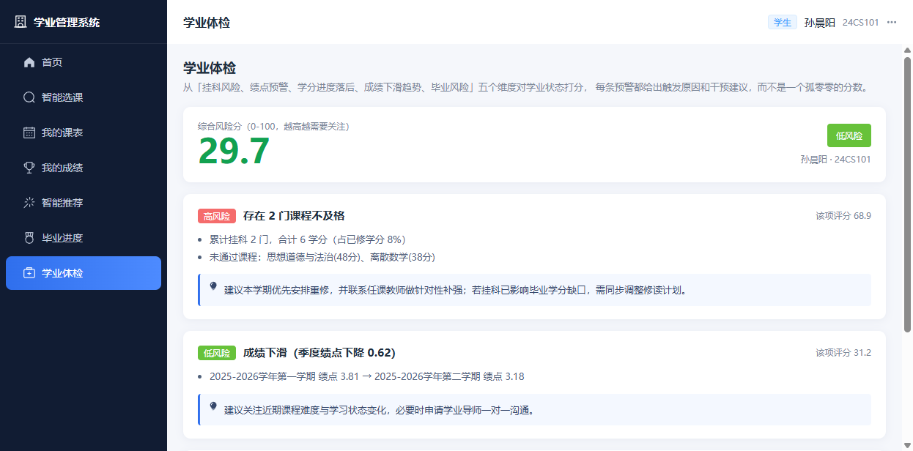
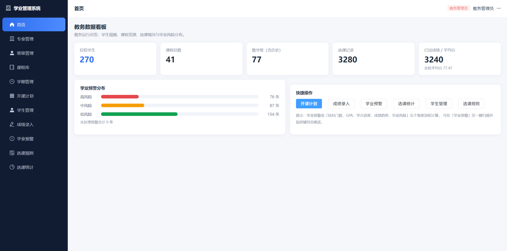
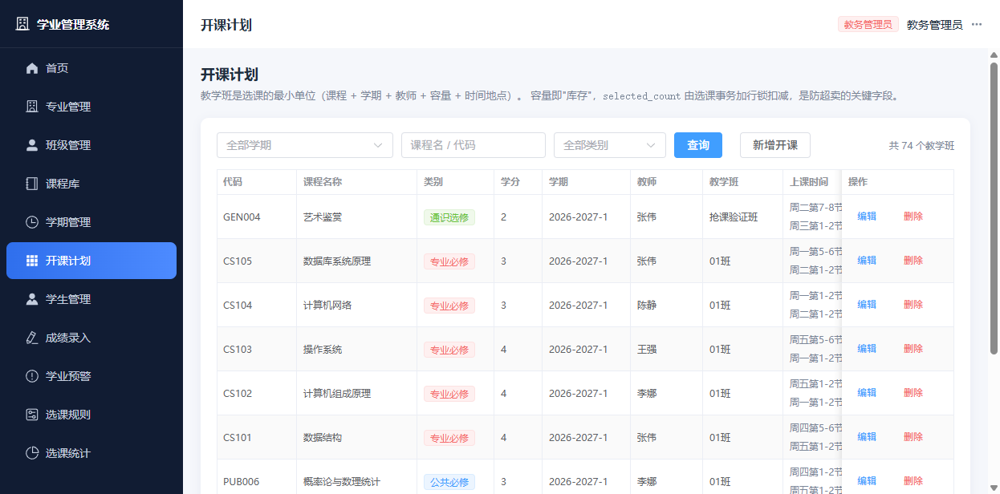
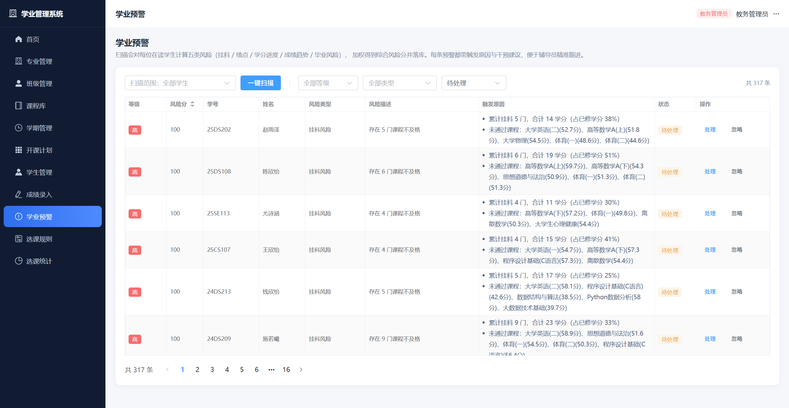
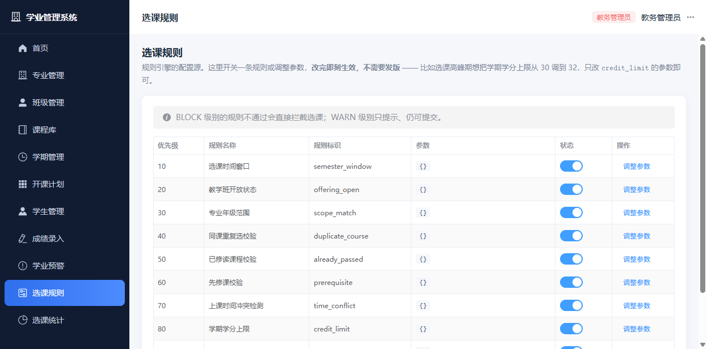

# 学业过程管理与智能决策系统

面向高校教务管理与学生学业规划场景的前后端分离系统。解决课程选修、成绩管理、毕业进度分析、
学业风险识别等流程分散的问题，把「选课冲突判断」「学业风险判断」这类原本靠经验的工作，
沉淀成**可配置、可解释、可批量执行**的规则与算法。

---

## 一、技术栈

| 层次 | 技术选型 |
| --- | --- |
| 后端框架 | FastAPI 0.115 + Python 3.13（RESTful API，自动生成 OpenAPI 文档） |
| ORM | SQLAlchemy 2.0（Mapped 声明式模型 + selectinload 预加载） |
| 数据库 | MySQL 8.0（InnoDB，utf8mb4，行锁 + 唯一约束兜底） |
| 缓存/中间件 | Redis（token 黑名单、分布式锁、热点缓存、推荐结果缓存） |
| 认证 | JWT（HS256）+ bcrypt 密码哈希 + RBAC 角色权限 |
| 前端 | Vue 3 + Vite 5 + TypeScript + Element Plus + Pinia + Vue Router + axios |
| 端口 | 后端 8008 / 前端 5174（避开本机已占用的 8000、5173） |

## 二、功能模块

**学生端**
- 智能选课：可选课程列表带规则判定、选课预检诊断、一键选课/退课
- 个人课表：周一~周日 × 1-12 节网格化课表，支持切换历史学期
- 学业概览：GPA、已获学分、本学期学分、风险等级一屏掌握
- 成绩管理：成绩单、学分加权 GPA、各学期趋势、挂科清单、班级排名
- 智能推荐：协同过滤 + 规则因子融合的个性化课程推荐，附推荐理由
- 毕业进度：分类别学分完成度、待完成必修课清单、按期毕业研判
- 学业体检：五维风险自检，每条风险带原因与干预建议

**管理端**
- 专业 / 班级管理
- 课程库：含先修课关系配置（直接驱动选课规则引擎）
- 学期管理：一键开启/关闭选课并设置选课窗口
- 开课计划：教学班排课（周次 + 节次），容量即"库存"
- 学生管理：账号与学籍档案同事务创建、重置密码、学业报告
- 成绩录入：教学班花名册批量录入，总评按权重自动计算
- 学业预警：一键批量扫描、按等级/类型筛选、处理与忽略
- 选课规则：规则的启停与参数调整，改完即刻生效
- 选课统计：各教学班选课率排行

## 三、界面预览

**学生端**

| 学业概览 | 智能选课 |
| :-: | :-: |
|  |  |

| 个人课表 | 智能推荐 |
| :-: | :-: |
|  |  |

| 毕业进度 | 学业体检 |
| :-: | :-: |
|  |  |

**管理端**

| 教务数据看板 | 开课计划 |
| :-: | :-: |
|  |  |

| 学业预警 | 选课规则配置 |
| :-: | :-: |
|  |  |

> 全部 12 张截图见 [docs/screenshots](docs/screenshots)（含课程库、选课统计等其他页面）。

## 四、目录结构

```
new_studentSystem/
├── backend/
│   ├── app/
│   │   ├── main.py                 # 应用入口（含启动自检、统一异常处理）
│   │   ├── core/                   # 配置、安全、鉴权依赖、Redis、异常
│   │   │   ├── config.py           # pydantic-settings 统一配置
│   │   │   ├── security.py         # bcrypt + JWT
│   │   │   ├── deps.py             # 鉴权与角色校验依赖注入
│   │   │   ├── redis_client.py     # 缓存/黑名单/分布式锁（含降级）
│   │   │   └── exceptions.py       # 业务异常 + 全局异常处理器
│   │   ├── db/                     # 引擎、Session、建库建表
│   │   ├── models/                 # 15 张表的 ORM 模型
│   │   ├── schemas/                # Pydantic 请求/响应模型
│   │   ├── api/v1/                 # 10 个路由模块，65 个接口
│   │   └── services/               # 业务核心：规则引擎、选课、推荐、风险、成绩
│   ├── scripts/
│   │   ├── seed_data.py            # 一键生成完整演示数据
│   │   ├── concurrency_test.py     # 并发抢课压测（验证防超卖）
│   │   └── api_smoke_test.py       # 端到端冒烟测试（34 项断言）
│   ├── requirements.txt
│   └── .env.example
├── frontend/
│   └── src/
│       ├── api/                    # axios 封装 + 接口定义
│       ├── stores/                 # Pinia 用户与权限状态
│       ├── router/                  # 路由表 + 权限守卫
│       ├── layout/                  # 主框架（按角色渲染菜单）
│       └── views/                   # 登录 / 学生端 7 页 / 管理端 10 页
└── docs/
    ├── ARCHITECTURE.md             # 架构与核心设计
    ├── DATABASE.md                 # 数据库设计
    ├── API.md                      # 接口文档（含示例）
    └── INTERVIEW.md                # 面试问答（项目讲解口径）
```

## 五、快速开始

### 0. 一键启动（推荐）

```bash
# Windows：双击 start.bat
# Git Bash / macOS / Linux：
bash start.sh
```

脚本会自动：查找 Python / Node 解释器 → 检查端口是否已被占用（已启动则跳过）→
首次运行自动安装前端依赖 → 拉起前后端 → 等待就绪并打印访问地址。
日志输出到 `backend/uvicorn.log` 与 `frontend/vite.log`。

`start.sh` 的 Python 解释器查找顺序：环境变量 `PYTHON` → `backend/.venv` → 本机已装好的隔离环境 → `python3`/`python`。

### 1. 准备环境
- Python 3.11+
- MySQL 8.0（默认 127.0.0.1:3306）
- Node.js 18+
- Redis 6+（可选，未启动时系统自动降级运行）

### 2. 后端

```bash
cd backend

# 创建虚拟环境并安装依赖
python -m venv .venv
.venv/Scripts/pip install -r requirements.txt     # Windows
# source .venv/bin/activate && pip install -r requirements.txt   # macOS/Linux

# 配置数据库连接
cp .env.example .env      # 修改 DB_PASSWORD 等
```

`backend/.env` 关键配置：

```ini
DB_HOST=127.0.0.1
DB_PORT=3306
DB_USER=root
DB_PASSWORD=你的密码
DB_NAME=student_academic
REDIS_HOST=127.0.0.1
REDIS_PORT=6379
JWT_SECRET_KEY=改成一段足够长的随机串
```

```bash
# 启动服务（首次启动会自动建库、建表、写入内置规则）
python -m uvicorn app.main:app --host 127.0.0.1 --port 8008 --reload

# 灌入演示数据（3 专业 / 18 班 / 270 学生 / 41 门课 / 3000+ 条历史成绩）
python scripts/seed_data.py --reset
```

- Swagger 文档：http://127.0.0.1:8008/docs
- 健康检查：http://127.0.0.1:8008/health

### 3. 前端

```bash
cd frontend
npm install
npm run dev            # http://127.0.0.1:5174
```

前端通过 Vite 代理把 `/api` 转发到 `127.0.0.1:8008`，无需额外配置跨域。

### 4. 演示账号（密码统一 `123456`）

| 角色 | 账号 | 说明 |
| --- | --- | --- |
| 教务管理员 | `admin` | 全部管理功能 |
| 教师 | `T1001` ~ `T1004` | 成绩录入、预警查看、开课查看 |
| 学生 | `24CS101` | 2024 级计算机，有 4 学期历史成绩（推荐效果好） |
| 学生 | `25SE203` | 2025 级软件工程，2 学期历史成绩 |
| 学生 | `26DS105` | 2026 级新生，**无历史成绩**（演示推荐冷启动） |

学生账号规则：`{入学年份后两位}{专业代码}{班号}{序号}`

### 5. 验证脚本

```bash
cd backend
python scripts/api_smoke_test.py                     # 端到端冒烟测试，预期 34 项全通过
python scripts/concurrency_test.py --threads 40      # 并发抢 3 个名额，验证不超卖
```

---

## 六、核心亮点（面试可讲）

### 1. 选课并发安全：三重防线，实测不超卖

| 防线 | 手段 | 挡住什么问题 |
| --- | --- | --- |
| 第一层 | Redis 幂等键（SET NX EX） | 用户双击/网络重试造成的重复提交 |
| 第二层 | Redis 分布式锁（SET NX PX + Lua 释放） | 多实例部署下同一教学班的请求争用 |
| 第三层 | MySQL `SELECT ... FOR UPDATE` 行锁 | **并发扣减的真实正确性**，防超卖 |

配套设计：全局统一加锁顺序（先学生行、后教学班行）预防死锁；死锁/锁等待超时自动重试最多 3 次；
数据库层 `UNIQUE(student_id, course_id, semester_id)` 做最后兜底。

> 实测：容量 3 的教学班，40 线程并发抢课 → 恰好 3 人成功，`selected_count` 与真实记录数完全一致。

### 2. 可配置规则引擎：改规则不改代码

9 条规则（选课窗口、教学班状态、专业年级范围、重复选课、已修读、先修课、时间冲突、学分上限、毕业缺口）
以责任链 + 策略模式实现，配置存在 `t_select_rule` 表里，支持启停与参数热调整。

两个细节设计：
- **不短路**：即使第一条规则就拦住了，也会把全部规则跑完，前端能一次给出完整"选课体检报告"；
- **两级判定**：BLOCK 硬性拦截，WARN 仅提示仍可提交（例如"已修读并及格，如需重修请走重修通道"）。

### 3. 混合推荐：协同过滤 + 规则因子，解决冷启动

    [候选集] → [召回] Item-CF + User-CF 加权 → [过滤] 规则引擎剔除不可选 → [重排] 多因子打分

- 协同过滤用 `final_score/100` 作显式反馈、选课行为作 0.6 的隐式反馈，课程余弦相似度 Top20 邻居存 Redis；
- 规则因子包含毕业缺口（权重最高）、专业匹配、时间可行性、年级适配、选课热度；
- **冷启动兜底**：CF 无信号时按课程热度给先验分，保证新生也能拿到推荐；
- **可解释**：每条推荐都给出"为什么推这门课"，并支持 `recommend/explain/{course_id}` 查询依据。

### 4. 学业风险量化：把辅导员经验变成可执行规则

五类风险各自打分（0-100），按权重（0.35/0.25/0.20/0.10/0.10）合成综合风险分并映射等级：
挂科风险、绩点预警、学分进度落后、成绩下滑趋势、毕业风险（线性外推）。

每条预警都带 `reason`（结构化原因）与 `suggestion`（干预建议），
支持按班级/专业批量扫描并落库，同一学生同类型同批次 upsert 避免重复刷屏。

### 5. 其他工程细节

- **N+1 问题**：`selectinload` 预加载 + 规则校验先装配"学业状态快照"再跑规则，一次选课从 N 次查询降到常数级；
- **连接池**：`pool_pre_ping + pool_recycle` 解决 MySQL 长连接失效；
- **中间件降级**：Redis 不可用时缓存/锁/黑名单全部 fail-open，核心业务不被拖垮；
- **统一错误结构**：`{code, message, data}` 全局一致，前端拦截器一处处理；
- **越权防护**：学生接口一律从 token 取档案，不接受前端传 `student_id`，从根上堵住 IDOR。

---

## 七、文档索引

- [架构与核心设计](docs/ARCHITECTURE.md)
- [数据库设计](docs/DATABASE.md)
- [接口文档](docs/API.md)
- [面试问答口径](docs/INTERVIEW.md)
